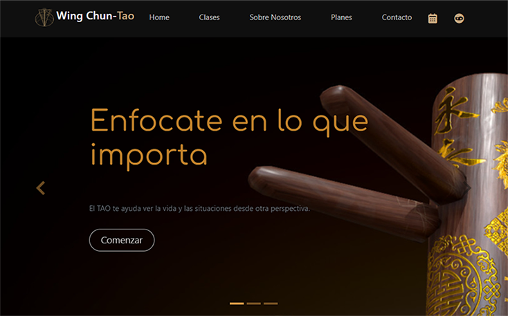
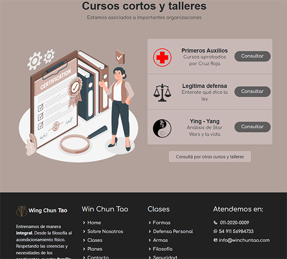
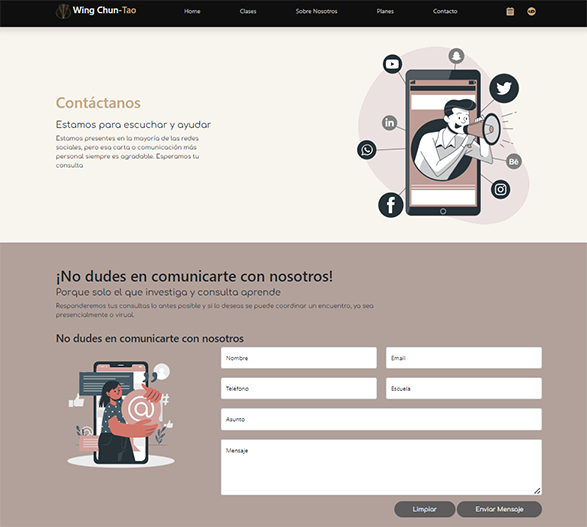
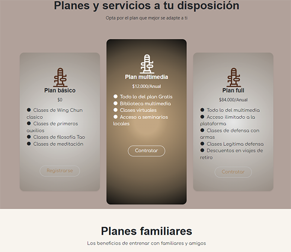
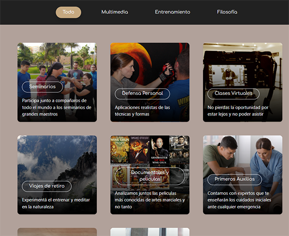

# Wing Chun Tao

[Wing Chun Tao](https://elicasama.github.io/wing-chun-tao/) es un sitio web para una institución marcial ficticia.

## Proyecto 
Puedes ver el sitio ingresando a [Wing Chun Tao](https://elicasama.github.io/wing-chun-tao/)

El sitio web corresponde al trabajo integrador del curso **Codo a Codo 2021 - Comisión #2014**

En el mismo se tomó un template de boostrap básico y se procedió a modificar las secciones, imágenes y efectos.

## Desafíos

En el proceso aprendí

- Modificaciones de templates en boostrap
- Armado de formularios
- Diseño responsive

## Screenshots

 

 

